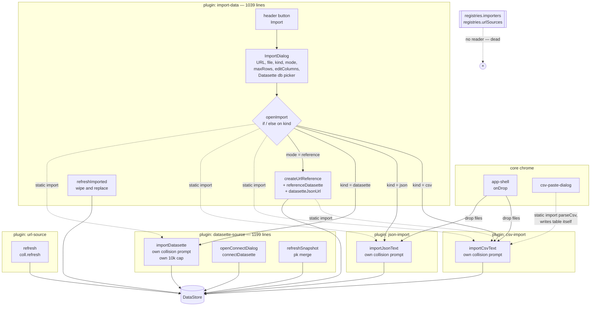
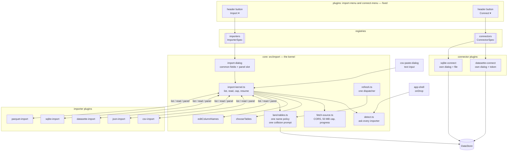
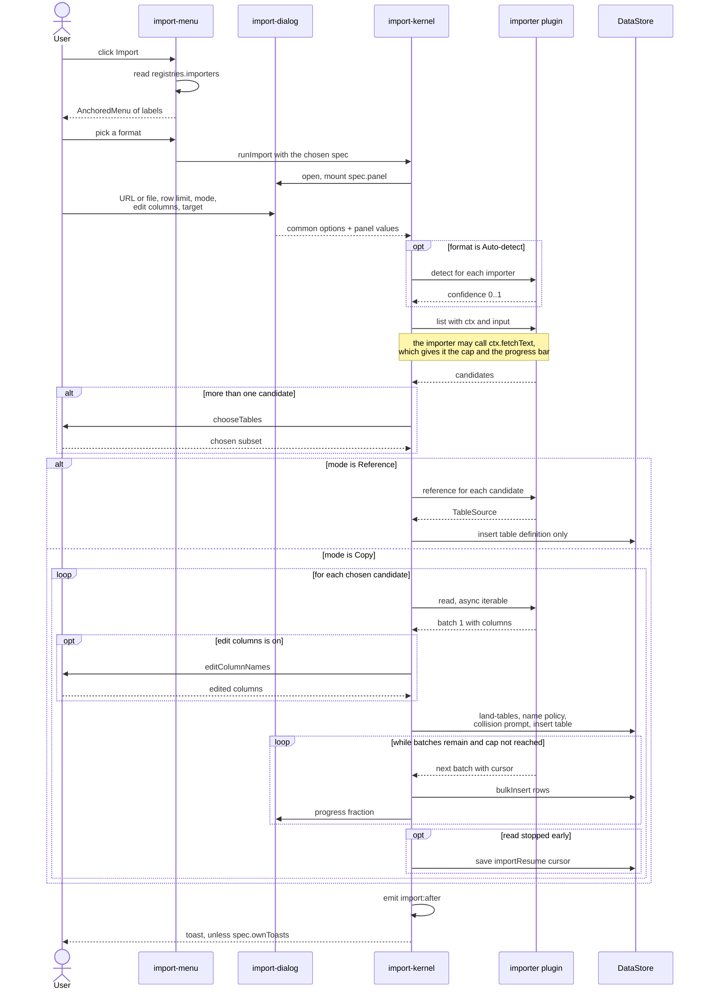

# Importer architecture — split the common part from the plugin part

Date: 2026-07-28
Status: concept, not implemented
Backlog item: `TODO.md:20`

## 1. Context

Today one plugin owns the whole import flow. `packages/renderer/src/plugins/import-data.ts`
is 1039 lines. It holds a closed format list, one Lit dialog, and an `if/else`
dispatcher. It reaches into four sibling plugin modules by static import:

```ts
import { importCsvText, parseCsv, readCsvHead } from './csv-import.js';
import { fetchDatabaseNames, fetchTablesForDb, parseDatasetteUrl } from './datasette-client.js';
import { importDatasette } from './datasette-source.js';
import { importJsonText, parsedToTables } from './json-import.js';
```

A new format (SQLite, Parquet, SQL) therefore needs an edit to the core plugin.
That is the opposite of the plugin model in
`.claude/plans/2026-05-21-rewrite-architecture.md`.

Two more problems come with it:

1. `registerImporter` and `registerUrlSource` are **write-only**. `registries.ts`
   fills `importers`, `exporters` and `urlSources`, but no code reads them.
   Only `dropHandlers` is read (`chrome/app-shell.ts:403`). The documented
   contract in `docs/PLUGINS.md:68` does not work.
2. Import and Connect are mixed. `datasette-source.ts` is 1199 lines and holds
   both pipelines. Import shares the core dialog. Connect has its own dialog.

The goal is one shared import kernel plus small format plugins, and a Connect
path that is fully separate from Import.

## 2. What is tangled today

| Concern | Where it is now | Problem |
|---|---|---|
| Format list | `import-data.ts:30` closed union `'auto' \| 'json' \| 'csv' \| 'datasette'` | a new format edits the core |
| Dispatch | `openImport()` `if/else` chain, `import-data.ts:292-357` | cross-plugin static imports |
| File `accept` filter | hard-coded string, `import-data.ts:932` | ignores `ImporterSpec.accept` |
| Sample sources | `PREDEFINED[]`, `import-data.ts:63-76` | mixes three formats in the core |
| Datasette database picker | `renderDbPicker()`, `import-data.ts:837-876` | backend UI inside the generic dialog |
| Datasette reference URL | `datasetteJsonUrl()` L410, `referenceDatasette()` L421 | backend logic inside the core |
| "Edit columns" checkbox | `import-data.ts:989`, shown only for CSV | should work for every format |
| Row limit | generic control, but CSV, JSON and Datasette each honor it differently. Datasette ignores it and warns at L1012 | one contract needed |
| Fetch, size cap, progress | `fetchImportText()` L156, `MAX_IMPORT_BYTES` L118, private | every importer needs it |
| Table creation | five inline copies: `csv-import.ts:161`, `json-import.ts:227`, `datasette-source.ts:450` and `:858`, `import-data.ts:482` | five schemas drift |
| Name collision | three different prompts and three different name-uniquing rules | one policy needed |
| Refresh | four implementations, three table buttons all named "Refresh" | one dispatcher needed |
| `cryptoUUID` / `slug` | copied into five plugin files | one utility needed |
| Toast policy | `app-context.ts:147` hard-codes `if (source === 'datasette') return` | needs a flag |

### 2.1 Control flow today

Dashed edges are static cross-plugin imports. Every leaf writes its own table
record and runs its own collision prompt.



## 3. The concept — three layers

```
┌─ Layer 3: entry points (core chrome) ─────────────────────────┐
│  [Import ▾]  AnchoredMenu of registered importers             │
│  [Connect ▾] AnchoredMenu of registered connectors            │
└───────────────────────────────────────────────────────────────┘
┌─ Layer 2: the import kernel (core, src/import/) ──────────────┐
│  <import-dialog> frame  •  fetch + progress + size cap        │
│  candidate picker  •  column editor step  •  row cap          │
│  name policy  •  table writer  •  origin stamp  •  resume     │
│  refresh dispatcher  •  toasts + import:before / import:after │
└───────────────────────────────────────────────────────────────┘
┌─ Layer 1: importer plugins (one per format) ──────────────────┐
│  csv  json  datasette  sqlite  parquet  sql  …                │
│  each gives: detect() • list() • read() • optional panel      │
└───────────────────────────────────────────────────────────────┘
```

The kernel is core code, not a plugin. Layer 3 needs one small `import-menu`
plugin so the button stays a plugin, the same way `dump-export.ts:16-47`
already owns the Export menu.

### 3.1 The split, field by field

Common (the kernel owns it, every importer gets it free):

- Source: URL text box, file upload, paste text, drag and drop.
- Sample source dropdown, filled from every importer's own `samples`.
- Format: "Auto-detect" plus an explicit override.
- Row limit.
- "Edit columns before import".
- Copy or Reference.
- Target: new table, append, or overwrite, with the table list.
- Which tables, for a multi-table source.
- Fetch: CORS rewrite, 50 MB cap, clear errors, slow-read progress bar.
- Resume of a stopped import.
- Refresh of an imported table.

Plugin specific (the importer owns it):

- `detect()` — how sure am I that this URL or file is mine.
- `list()` — which tables does this source offer.
- `read()` — give me columns and row batches for one table.
- An optional Lit panel for extra fields (delimiter, Datasette database picker,
  SQLite attach options).
- Optional sample sources.
- Optional `reference()` — the `TableSource` for a live reference table.

### 3.2 The dialog

One core element keeps the tag name `<import-dialog>`. The existing e2e specs
use `locator('import-dialog dialog')`, so most of them keep working.

```
┌─ Import — CSV ──────────────────────────┐
│ Sample     [— choose a sample —      ▾] │  core
│ URL        [_____________________]      │  core
│ or file    [Choose…]  or drop here      │  core
│ Format     [CSV                     ▾] │  core
│ ╭─ plugin panel ───────────────────────╮│
│ │ Delimiter [ , ▾]   Header row  [x]  ││  plugin
│ ╰──────────────────────────────────────╯│
│ Limit rows [______]                     │  core
│ Mode       (•) Copy   ( ) Reference     │  core
│            [x] Edit columns before      │  core
│ Target     [new table               ▾] │  core
│                       [Cancel] [Import] │
└─────────────────────────────────────────┘
```

Changing Format swaps the panel. The panel is a registered custom element tag,
so the kernel never imports plugin code.

### 3.3 Control flow after the change

Two entry points, two registries, no cross-plugin import.



One import run, step by step. The importer is called three times at most, and
never touches the store.



## 4. New contracts in `packages/shared/src/plugin-api.ts`

Replace the dead `ImporterSpec` with a working one. Keep the name, so
`meta.type === 'importer'` and `docs/PLUGINS.md` stay true.

```ts
export interface ImportSourceInput {
  kind: 'url' | 'file' | 'text';
  url?: string | undefined;
  file?: File | undefined;
  text?: string | undefined;
}

/** One table a source offers. `handle` is opaque and private to the importer. */
export interface ImportCandidate {
  name: string;
  rowCount: number | null;
  detail?: string | undefined;   // e.g. the database a table belongs to
  hidden?: boolean | undefined;  // shown tagged and unchecked, as today
  handle: unknown;
}

/** One chunk of rows. The first batch must carry `columns`. */
export interface ImportBatch {
  columns?: ColumnSpec[] | undefined;
  rows: Array<Record<string, unknown>>;
  /** Cursor to resume from if the read stops. Persisted as `importResume`. */
  nextCursor?: string | undefined;
  totalCount?: number | undefined;
}

export interface ImportCtx {
  api: HostApi;
  /** Fetch text with the CORS rewrite, the size cap and the progress bar. */
  fetchText(url: string, label?: string): Promise<string>;
  /** Values the importer's own panel element reported. */
  panel: Record<string, unknown>;
  /** Resume cursor from a stopped import, when the user pressed Resume. */
  cursor?: string | undefined;
}

export interface ImportSample {
  label: string;
  url: string;
}

export interface ImporterSpec {
  id: string;                 // 'csv' | 'json' | 'datasette' | 'sqlite' | …
  label: string;              // menu entry and Format option
  icon?: string;
  order?: number;
  accept?: string[];          // file picker filter
  samples?: ImportSample[];
  /** Custom element tag rendered in the dialog panel slot. */
  panel?: string;
  supports?: {
    url?: boolean;
    file?: boolean;
    text?: boolean;
    reference?: boolean;
    multiTable?: boolean;
  };
  /** Confidence 0..1 that this input is mine. Drives Auto-detect and drop. */
  detect?(input: ImportSourceInput): number;
  /** List the tables the source offers. A single-table format returns one. */
  list(ctx: ImportCtx, input: ImportSourceInput): Promise<ImportCandidate[]>;
  /** Read one candidate as a stream of batches. */
  read(ctx: ImportCtx, candidate: ImportCandidate): AsyncIterable<ImportBatch>;
  /** Build the live `TableSource` for Reference mode. */
  reference?(ctx: ImportCtx, candidate: ImportCandidate): TableSource;
  /** True when the importer emits its own toasts. Replaces the hard-coded
   *  `if (source === 'datasette')` check in `app-context.ts:147`. */
  ownToasts?: boolean;
}
```

The async iterable is the important choice. It gives the kernel one uniform
place to apply the row cap, drive the progress bar, save the resume cursor and
survive a 429. CSV and JSON yield one batch. Datasette yields one batch per
page. SQLite and Parquet yield chunks.

The connector contract stays deliberately thin. Connect flows differ too much
to force a shared frame — a token, a local file, a DSN.

```ts
export interface ConnectorSpec {
  id: string;
  label: string;
  icon?: string;
  order?: number;
  /** Opens the connector's own dialog. Returns new table ids, or null. */
  connect(api: HostApi): Promise<string[] | null>;
}
```

Add to `UiRegistry`:

```ts
  registerConnector(spec: ConnectorSpec): Unregister;
```

## 5. Files

New kernel directory `packages/renderer/src/import/`:

| File | Holds |
|---|---|
| `import-dialog.ts` | the `<import-dialog>` frame with the panel slot |
| `import-kernel.ts` | `runImport()` — pick, list, read, cap, land, toast |
| `fetch-source.ts` | `fetchImportText`, `MAX_IMPORT_BYTES`, progress bar (moved from `import-data.ts:118-235`) |
| `land-tables.ts` | one table writer, one collision policy, one name-uniquing rule |
| `refresh.ts` | one refresh dispatcher keyed on `origin.type` and `source.type` |
| `detect.ts` | runs `detect()` over the registered importers |

New `packages/renderer/src/util/ids.ts` — `cryptoUUID()` and `slug()`. This
removes five copies.

Plugin roster after the change:

| Plugin | Type | Note |
|---|---|---|
| `import-menu` | `ui`, `fixed` | renames `import-data`. Header button plus AnchoredMenu. |
| `connect-menu` | `ui`, `fixed` | header Connect button plus AnchoredMenu. |
| `csv-import` | `importer` | keeps the Paste CSV dialog |
| `json-import` | `importer` | |
| `datasette-import` | `importer` | split out of `datasette-source.ts` |
| `datasette-connect` | `source` | split out of `datasette-source.ts` |
| `url-reference` | `source` | renames `url-source.ts` |
| `sqlite-import` | `importer` | later |
| `parquet-import` | `importer` | later |
| `sqlite-connect` | `source` | later, local `.db` file |

Reused as is, no change: `datasette-client.ts`, `datasette-collection.ts`,
`read-url.ts`, `table/refresh-merge.ts`, `table/column-merge.ts`,
`dialogs/table-select-dialog.ts` (`chooseTables`),
`dialogs/column-names-dialog.ts` (`editColumnNames`),
`chrome/anchored-menu.ts`, `chrome/top-progress.ts`.

`registries.ts` gains real read sites for `importers` and a new `connectors`
list. `urlSources` is dead and unreachable — delete it, or keep the type and
mark it deprecated in `docs/PLUGINS.md`.

## 6. Order of work

Each phase must keep `npm run typecheck` and `npm run test:e2e` green.

| Phase | Work | Risk |
|---|---|---|
| A | Extract the kernel with no behavior change. Move fetch, ids and the table writer out of the plugins. `import-data` still dispatches. | low |
| B | Add the new contracts. Make `registries.importers` live. Add the AnchoredMenu and the panel slot. | low |
| C | Move CSV and JSON to the new spec. Delete their branches from the dispatcher. | medium |
| D | Split `datasette-source.ts` into `datasette-import` and `datasette-connect`. | medium |
| E | Add `registerConnector` and the core Connect menu. Datasette becomes one menu entry. | low |
| F | Fold the four refresh paths into one dispatcher and one table button. | medium |
| G | Add the SQLite and Parquet importers. New work, not a refactor. | new |

Phase F fixes a real bug on the way: `refreshImported()`
(`import-data.ts:237`) wipes and replaces, while `refreshSnapshot()`
(`datasette-source.ts:975`) merges by primary key and respects
`deletedColumns`. After the merge every format gets the good behavior.

## 7. Model changes

None are needed. `Table.origin`, `Table.source`, `Table.importResume` and
`Table.deletedColumns` already carry everything.

Two optional additions, both non-indexed, so no Dexie version bump:

- `TableOrigin.importerId` — which importer made this table. The refresh
  dispatcher can then look the importer up directly instead of guessing from
  `origin.type`. Fall back to `origin.type` for old records.
- `TableOrigin.panel` — the panel values used at import time, so a refresh
  reuses the same delimiter or database.

Adding a field to `types.ts` alone is enough here. Confirm before adding them.

## 8. How to test

1. Run `npm run typecheck`.
2. Run `npm run test` for the unit suites.
3. Run `npm run test:e2e`. Fourteen specs cover import today:
   `06-import-export`, `14-datasette-import`, `15-datasette-connect`,
   `19-csv-url-import`, `20-csv-edit-columns`, `24-reimport-origin`,
   `26-import-upload`, `29-datasette-hidden`, `32-datasette-rate-limit`,
   `33-refresh-recreates-columns`, `34-resume-import`.
4. Keep the `<import-dialog>` tag name so those selectors keep working. Add new
   specs for the menu, the panel slot and the Connect menu.
5. Check by hand at `http://localhost:5190` after `npm run dev:renderer`:
   - Import menu lists every importer.
   - CSV from URL, CSV upload, JSON dump, Datasette table, Datasette database.
   - Row limit works for Datasette too. That is new.
   - "Edit columns" works for JSON too. That is new.
   - Copy and Reference both work for every format.
   - Connect menu opens the Datasette connect dialog. Import never does.
   - One Refresh button per table, whatever the origin.

## 9. Open points

1. `docs/PLUGINS.md:168-234` documents the old importer layout. Rewrite it.
   Add a short `docs/IMPORT.md` for the kernel and the two contracts.
2. The Paste CSV dialog (`dialogs/csv-paste-dialog.ts`) is a third CSV entry
   point. It parses and writes the table itself, so it skips the collision
   prompt, the row limit and the column editor. Route it through the kernel as
   a `text` input.
3. `datasette-source.ts:271` registers a `text/plain` drop handler, but
   `app-shell.ts:399` returns early unless the drop carries files. That handler
   never runs. Let the kernel handle a dropped URL through `detect()`.
4. Reference mode pulls one page only (`_size=max`), while Copy pages fully.
   That caveat is recorded in `TODO.md:37`. It stays open.
5. The parked design `.claude/plans/2026-07-26-datasette-virtual-tables-design.md`
   touches the Connect side. Check it before Phase D.
