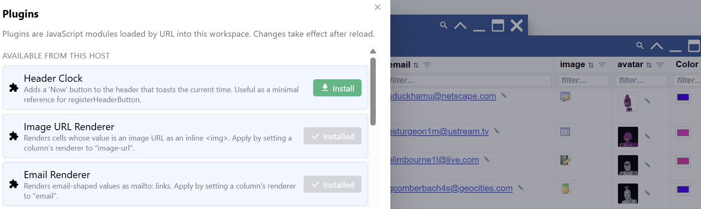
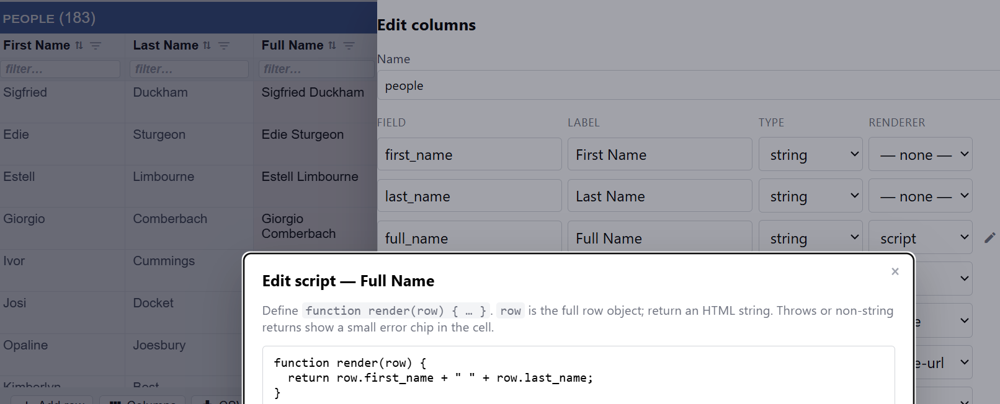

# Editing Cells & Renderers

## Adding a record

The **+** in a table's footer opens a small form: one box per field, with any
defaults the columns carry already filled in. Press **Save** and the record is
added.

The form shows the fields the table **shows**. Tick **Show all fields** for the
hidden ones — they are saved either way, with their defaults, so a hidden column
never ends up empty just because you did not see it. A computed column is never
asked for, because its value comes from its script.

Rules are checked as you type and the reason appears under the field. **They do
not stop you saving.** The button reads **Save anyway** on the first press, so you
know the record goes in with the problem, and the message afterwards says how many
went with it. A half-known record is usually worth keeping — the grid marks what
is wrong, and the ✓ button lists it later.

One rule cannot be checked here: **Unique**. It needs the other rows, and a record
that does not exist yet has nothing to be a duplicate of. Editing the cell
afterwards, or pressing ✓, catches it.

## Editing a cell

Click any cell to edit it. Checkboxes for booleans, date pickers for dates,
and a plain text/number box otherwise. Press **Esc** while editing to cancel
and revert to the stored value.

Dates and times are shown on your own clock: a value that carries a timezone is
converted to it, and one without a timezone is left as it was written, because it
is already a wall-clock time. A view of the same column shows it the same way.

A column can enforce rules, and a bad edit is rejected with a message
explaining why, rather than silently discarded:

- **Required** — the cell can't be left empty.
- **Max length/value** — a string or number can't exceed a limit.
- **Unique** — the value can't already exist elsewhere in the column.
- **A validation rule of your own** — see below.

## Writing your own validation rule

When the tick-boxes can't say it, a column can carry a small piece of
JavaScript that decides for itself. Open the column editor (the **Columns**
button in the window footer) and click the **rule button to the right of the Max
box** (the one with the ✓/✗ list on it, not the pencil):

```js
function validate(value, row) {
  if (!/^[A-Z]{2}-\d{4}$/.test(value)) {
    throw new Error(`"${value}" doesn't match the required format (e.g. AB-1234).`);
  }
}
```

**Throwing rejects the edit**, and your message is exactly what the person
editing sees. Returning without throwing accepts it. `value` is what they just
typed and `row` is the rest of the row — including the pending change — so a
rule can compare columns ("end can't be before start").

Don't want to write one from scratch? The editor's **Start from a sample**
dropdown has ten ready-made rules — required, email, web address, a number
range, positive numbers, text length, a fixed list of values, a pattern, a
date that isn't in the future, and one column compared against another. Pick
one, adjust the value at the top of it, and save. Picked the wrong one? **Undo**
puts back what was there.

Written a rule you will want again? The **+** next to the dropdown asks for a
name and puts it in the same list, under _Your samples_. The 🗑 beside it
deletes the one you have picked, after asking; the shipped samples can't be
deleted. Your samples belong to the workspace, so they travel with it.

The rule runs on **manual edits only**. Importing, refreshing and syncing are
not edits, so a rule can't stop a table from loading — it tells you about the
next value someone types. To check the rows you already have, use Validate,
below.

Validation is separate from the **pencil left of Max**, which computes what a
column **displays** — see
[Computing what a column shows](#computing-what-a-column-shows) below. The two
used to be the same pencil side by side; they carry different icons now.

### Switching a rule off without losing it

A rule you are debugging, or one that has to stand aside while a batch of
awkward data is loaded, does not have to be deleted. Untick **Enforce** at the
top of the editor and save: the rule stays on the column, and stops running.

The button in the column editor tells you which of the three states a column is
in at a glance:

| Colour   | Meaning                                    |
| -------- | ------------------------------------------ |
| **Gray** | no rule on this column                     |
| **Blue** | a rule, and it runs                        |
| **Red**  | a rule that is there but switched **off**  |

Tick the box again to switch it back on. Clearing the body instead deletes the
rule outright — and clears the switch with it, so a rule you write later starts
switched on.

## Checking every row: the ✓ button

Rules only meet a value as it is typed, so an imported table has never been
checked. The **✓** button in a table's footer checks all of it, against every
rule its columns carry: Required, Maximum, Unique and your own validation
scripts.

What you get back is a summary — one line per column, in the order the columns
appear — and **the table itself, narrowed to the rows with something wrong**.
Every cell that broke a rule is **pink**, and hovering it says why: `Age value 40
is over the maximum of 20`. Fix it in place.

Press ✓ again when you have finished. The rows you repaired drop out, and a run
that finds nothing leaves the table as it was.

### The `_error` column

Each run also writes the whole row's verdict into a column called `_error`,
created the first time it is needed. It is **hidden**, because the pink cell
already says it where you are looking — but it is an ordinary column:

- The **columns editor** shows it, so you can unhide it and read the messages in
  a column of their own. Once you unhide it, it stays unhidden.
- **Rename it** and it is yours. The messages come with it, the next ✓ leaves it
  alone, and a fresh `_error` is made for that run. This is how you keep a copy
  of what a run found.
- A script can read it as `row._error` like any other field.

Each run rewrites it: messages for the rows that are wrong now, and nothing on
the rows that are not. So it is never a verdict on data that has since changed.

Three more things worth knowing:

- A table whose columns carry no rules is not read at all. There is nothing to
  check, and the button says so instead of pretending to work.
- A long scan shows a bar under the header and can be stopped with **Esc**. It
  then reports what it found so far.
- A column stops listing after 500 problems and counts the rest, so one broken
  rule cannot bury the others.

The pink is a setting — **Highlight cells Validate flagged**, beside the
empty-cell one in Settings. Turning it off leaves the reason on hover.

## Renderers — changing how a value is displayed

A column's **renderer** controls how its value is _shown_, separately from
its underlying type. The same number, date, or text column keeps sorting
and validating the same way no matter which renderer you pick — only the
display changes. Renderers are chosen in the column editor.

Plugins can change how data is rendered — for example as a clickable link:



Or with a fully custom script that builds its own HTML from the row's data:



### Computing what a column shows

The pencil **left of the Max box** opens the other script — the one that
decides what the column _displays_:

```js
function render(row) {
  return (Number(row.qty) * Number(row.price)).toFixed(2);
}
```

Whatever you return is handed to the column's renderer instead of the stored
value, so `link` can point at a computed URL and `html` can show text you
built. A computed cell is read-only, because there is nowhere to write an edit
back to.

### Returning nothing hands the cell back

`return null` — or simply not returning — means *"nothing to say about this
row"*. The cell then shows what is **stored** in it, and behaves like any other
cell: you can type into it.

That is what lets a script read its own column. A script that decorates only the
rows it recognises leaves the rest editable, and picks up what you typed the
next time the cell is drawn:

```js
function render(row) {
  if (!row.code) return null; // nothing typed yet — let me type it
  return 'ref:' + row.code;
}
```

`return ''` is **not** the same thing. That is an answer — "show nothing here" —
and the cell stays computed and read-only. A script that throws is not the same
either: you get the error chip, so a broken script never hides your data by
looking like it declined.

Because the stored value is real data, a scripted column also appears on the
**+** form when you add a record — otherwise there would be no way to give a new
row the value its script reads.

This editor has its own **Start from a sample** dropdown, with ten scripts
covering what people actually ask a column for:

- **Text from other fields** — joining two columns into one.
- **Markdown** — `markdownToHtml(row.notes)` turns Markdown in a cell into
  formatted text. Pair it with the `html` renderer, or the cell shows the HTML
  source. It sanitises as it converts: formatting in your data survives, a
  `<script>` that arrived in a CSV doesn't.
- **URL building** — a link built from a field, one assembled with
  `URL`/`searchParams` (so spaces and `&` in the data can't break it), and a
  `mailto:` with a prefilled subject. Pair these with the `link` renderer.
- **Maths** — quantity × price, an amount as money via `Intl.NumberFormat`, a
  percentage that refuses to divide by zero, and days between a date and today.

Same **Undo** as the validation editor if you pick the wrong one. Each sample
says in its first line which renderer it expects — the dropdown can't set that
for you, it's the column's own Renderer box.

The **+** works here too, and this list is shared with views: a script
you save on a column is offered when you script a view's `$TOKEN`, and one you
save there is offered on your columns. Validation rules stay in their own list.

A display script has the same switch as a validation rule — untick **Run** at
the top of the editor and the column shows its stored value again, with the
script kept. Its button follows the same gray / blue / red as the rule button
beside it.

#### Turning a computed column into data

A script normally computes on the way to the screen and leaves the stored cell
alone. **Run…** in the script editor does the opposite: it writes what the
script returns into the cells, so the values become ordinary data you can
export, sync, filter and edit.

It asks twice before writing, because neither answer has a safe default:

- **Which rows** — only when the grid is showing fewer than the table holds.
  You can write the whole table or just what the filter left.
- **Keep or clear the script** — keeping it leaves the column computed and
  read-only, so the written values only show up in an export. Clearing it hands
  the column over to the data.

The write happens straight away and cannot be undone. Clearing the script is a
column edit like any other, so it lands when you save the columns editor. Rows
the script throws on are skipped and counted — the message says how many.

**Run…** is not offered while you are still creating a table: there are no
rows to write to yet.

### Built-in renderers

| Renderer           | What it shows                                                                                                                                |
| ------------------ | -------------------------------------------------------------------------------------------------------------------------------------------- |
| **Link**           | Detects URLs, email addresses, and phone numbers and turns them into clickable links. A pencil icon lets you switch to editing the raw text. See below for which URLs count. |
| **Color**          | A color swatch and picker for hex color values.                                                                                              |
| **Image**          | A thumbnail with an upload button; images are stored directly in the cell.                                                                   |
| **HTML (preview)** | Shows the plain text of an HTML value, trimmed to a short length, with a popup icon to view the full rendered HTML.                          |
| **HTML (render)**  | Renders the HTML directly in the cell, and lets you edit it inline.                                                                          |
| **Script**         | Runs a small script you write to build the cell's HTML from the whole row — for fully custom layouts.                                        |

#### What the Link renderer treats as a link

**Any scheme**, not just the web: `https://…`, `file:///C:/reports/june.pdf`,
`ftp://…`, and app links such as `obsidian://` or `vscode://`. A bare email
address becomes a `mailto:` link and a phone-shaped value a `tel:` one.

The whole cell has to be the link — a sentence with a URL in the middle of it
stays text. The exception is a `file:` path, which may contain spaces, because
local paths do.

Two things are deliberately **not** linked:

- `javascript:`, `vbscript:` and `data:` values. Following one runs it, and a cell
  can arrive from an import, a sync or a workspace someone sent you. They show as
  plain text.
- Text that merely contains a colon, like `TODO:fix this`. A scheme with no `//`
  only counts if it is one of the known ones (`mailto:`, `tel:`, `geo:`,
  `magnet:` and a few more).

**A `file:///` link opens in the desktop app, not in a browser tab.** A browser
refuses to open a local file from a web page, and does it silently — hover the
link and the tooltip says so. The text is still there to copy.

## Joining two tables by dragging a column

Drag a column's grip out of one table's header and drop it on **another**
table's window. The projection editor opens with **the table you dragged from**
as the base, the table you dropped on joined onto it, and the column you dragged
as the join key.

So the table you were working in stays the subject, and the drop says what to
bring alongside it: drag `deptId` off People onto Dept and you get your People
with the matching Dept rows attached.

If either table has a filter on, you are asked first whether the projection
should carry those filters or read all the data.

Dropped back on its own grid, the same drag reorders the column as it always
has. Dropped anywhere else, nothing happens.

## Column types still matter

Even with a custom renderer, a column's underlying **type** (number, date,
text, boolean) still decides how it sorts and what counts as a valid edit.
The renderer only changes what you see.

### String or text?

**String** is a short value — a name, a code, a status. Its funnel offers the
values the column holds, so you filter by picking one.

**Text** is prose — a description, a body, an abstract. Its funnel offers no
list at all, because every cell is different and too long to browse: the list
would be one entry per row. You filter a text column by typing into it instead,
which matches on any part of the value.

An import picks **text** for you when a column's values are consistently long
(about 120 characters or more), and gives it the preview renderer. One long
value among short ones is not enough — a single pasted paragraph in a column of
statuses leaves the column a string. You can change either way in the columns
editor; nothing about the stored data changes, only the filter.
