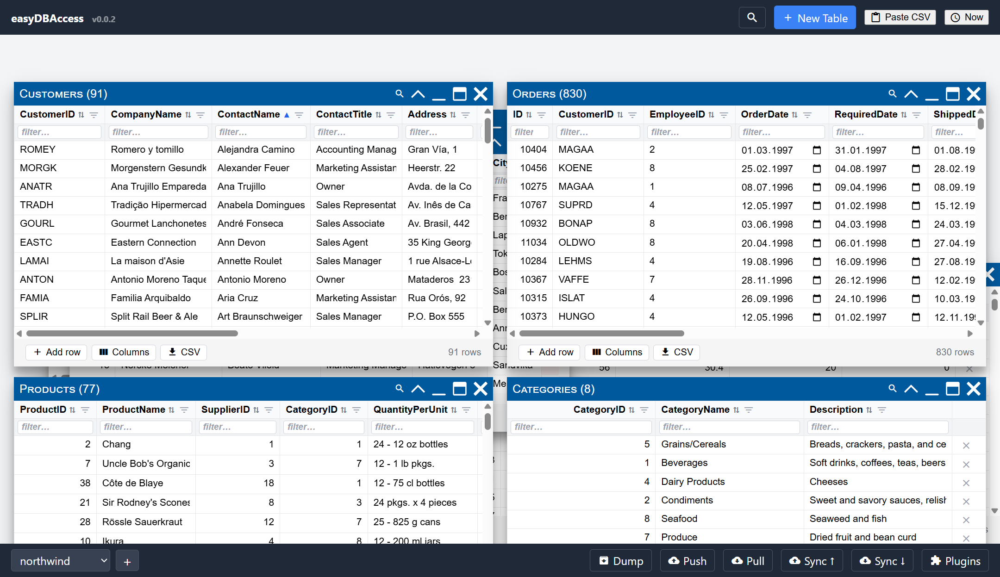

# Getting Started

easyDBAccess is a small database that lives entirely in your browser — no
server, no signup, no spreadsheet software. Open it, drop in a file, and you
have a working table you can sort, filter, edit, and export.

> Try it now: <https://cawoodm.github.io/easydbaccess/>

## Where your data lives

| Where it runs | Where your data lives |
|---|---|
| Browser tab | Your browser's own storage (IndexedDB) by default. Nothing leaves your device unless you turn on sync. |
| Browser tab, in a file | A real SQLite `.edb` file you choose and save yourself — see [Database Files](database-files.md). Opt in per workspace. |
| Desktop app (Electron) | One real SQLite `.db` file on your disk, which you can open, save elsewhere and back up like any other file — see [Database Files](database-files.md). |

Creating a workspace in a browser asks which of the first two you want:

- **Simple** keeps it in the browser. Nothing to save, nothing to lose track of.
- **Advanced** puts it in a `.edb` file you can copy, back up and open in other
  SQLite tools. You press **Save**, or turn on autosave.

You can change your mind later. The **File** button copies a browser workspace
into a file and leaves the browser copy alone.

Because everything is local by default, easyDBAccess works fully offline and
needs no account.

## Your first table

The fastest way to start is to drag a CSV or JSON file onto the browser
window — see [Importing Data](importing-data.md). You can also click **+ New
Table** in the header to define columns by hand.

Each table opens in its own window that you can drag, resize, minimize, and
maximize like a normal desktop window — see
[Tables and Windows](tables-and-windows.md).

## What to read next

- Dropped in a file? See [Importing Data](importing-data.md).
- Want to arrange your workspace? See
  [Tables and Windows](tables-and-windows.md).
- Want to sort or narrow down rows? See
  [Sorting, Filtering & Search](sorting-filtering-search.md).
- Ready to back up or move to another device? See
  [Sharing & Sync](sharing-and-sync.md).
