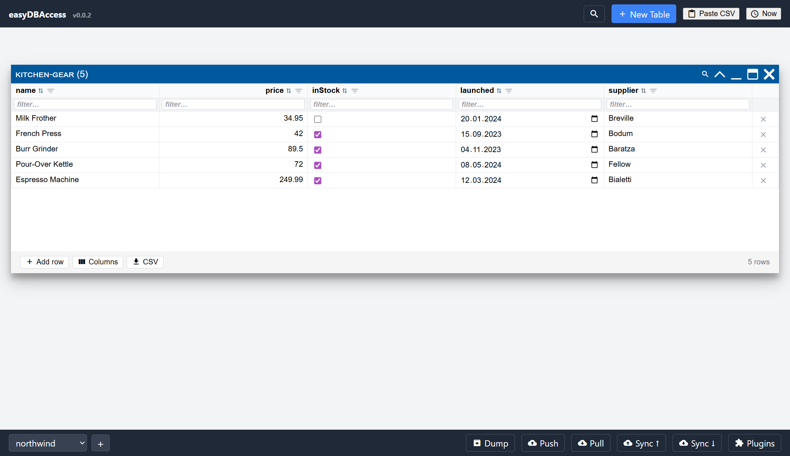
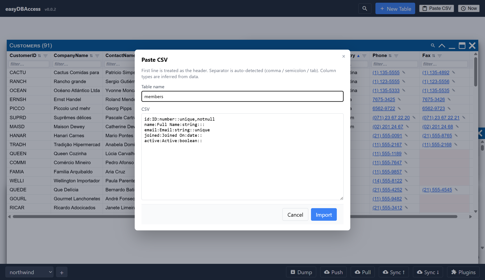

# Importing Data

## Drag and drop a file

Drop a CSV, TSV, or JSON file anywhere on the window. The first row becomes
your column headers, and each column's type (number, date, boolean, or text)
is guessed automatically from the data.



If a dropped CSV matches the name of a table you already have, you are asked
whether to **append**, **overwrite**, or create a **new table**. A dropped JSON
file just creates a new table, adding `-2` to the name if it is taken; use the
Import dialog's **Import into** if you want it to land in an existing table.

## Defining columns up front

Instead of relying on guessed types, you can start a CSV with a header line
that spells out each column using a small mini-language:

```
field:label:type:default:max:flags
```

For example:

```csv
id:ID:number::unique,notnull,name:Full Name:string:::,email:Email:string::unique,joined:Joined On:date::,active:Active:boolean::
```

Looking at each line:

- `id:ID:number::unique,notnull` A unique `id` field which may not be empty (like a primary key)
- `name:Full Name:string` A `name` field displayed as `Full Name`
- `email:Email:string::unique` A unique `email` field
- `joined:Joined On:date` A date field
- `active:Active:boolean` A boolean field



Only `field` is required — leave the rest blank to fall back to guessed
types. `flags` can be `unique` and/or `notnull`.

## The Import button

The header's **Import** button opens a dialog in two parts.

The first block holds what every format has in common:

- **Import as** — the format, or leave it on Auto-detect.
- A **URL** to read, or a **file** to upload.
- **Import mode** — Copy or Reference (see below).
- **Import into** — a new table, or append to / replace the rows of one you
  already have. You choose this before the import starts, so nothing
  interrupts it half-way.
- **Edit columns before import** — review and rename the columns first. A
  source with several tables asks once per table, and names each one.
- **Limit rows** — so a huge file does not have to load in full.
- A few curated **sample sources**, to try the app out.

The second block holds only the options of the format you picked. A CSV, for
example, offers a **Separator**: auto-detect, comma, semicolon, tab, pipe, or a
character you type. A `.tsv` or `.tab` file always uses TAB unless you override
it here.

## Connect is a different button

**Import** copies data in and the copy is yours: it is stored, synced, and you
can edit it offline. **Connect** points a window at a live table on someone
else's server and stores nothing.

They are separate buttons doing separate things. The **Connect** button lists
every backend you have installed — [Datasette](https://datasette.io/) today.

## Copy vs. Reference

When importing from a live source (like a [Datasette](https://datasette.io/)
instance), you choose:

- **Copy** (the default) — a normal table. Your data is saved locally and
  syncs like anything else; a **Refresh** button re-reads the source. Refresh
  keeps the columns you added, keeps your column order and widths, adds any
  column the source has grown since, and never brings back a column you
  deleted.
- **Reference** — a live, read-only table. Rows are fetched from the source
  on demand and are never stored or synced — useful for data too large or
  too fast-changing to copy. The grid shows the values without editors, and
  offers no add or delete row, because there is nowhere to write a change to.
  A paged source (a Datasette table, for one) is followed page by page up to
  50 000 rows, so a reference is not limited to the first page.

Referencing a Datasette **database** or **instance** asks which tables you want,
the same way a copy does.

## Importing many tables at once

All the windows open together, empty, and then fill one at a time. Each window
shows a moving bar from the moment it appears, so a table that is only waiting
its turn does not look like a table with no data in it. The bar becomes a
percentage as soon as that table knows how many rows it is getting.

A bar under the header follows the whole batch, with a count of the tables that
are done. It is weighted by rows, not by tables, so one big table and ten small
ones move it at an honest speed.

## What a Datasette import brings across

More than the rows. Whatever the instance is willing to tell us about a table
is read alongside its data and used to set the table up:

- the **primary key** is marked **unique** and **not null**, so the column that
  identifies a row is protected from a duplicate or a blank;
- columns the instance does not allow sorting on (its `sortable_columns`
  setting) arrive **not sortable** — their header doesn't sort;
- **column descriptions** become header tooltips and **units** are shown next
  to the column label;
- the table's **default sort**, its **description**, and its source, licence
  and about links (the (i) button) come across too.

None of it is locked in — it is a starting point. Open the column editor and
tick sortable back on, or change any other flag, and your version is what
sticks: a later **Refresh** leaves columns you already have alone.

## Read-only tables

Any table can be marked read-only: open the column editor (the **Columns**
button in the window footer) and tick **Read-only**. The grid then shows values
as plain text, with no add or delete row. Nothing about the stored data changes —
untick it to edit again. Referenced tables start out read-only.

## Restoring a whole workspace

A `.db.json` file (an export from easyDBAccess itself, see
[Sharing & Sync](sharing-and-sync.md)) is not one table — it is a whole
workspace, including window positions, views, sorting and filters. So it is
**restored**, not imported.

Drop the file and it restores in one go. Point the Import dialog at one and it
asks first, because you may have meant to import only its tables as plain data.
Either way you are then asked whether to merge it into your current workspace or
replace everything.
