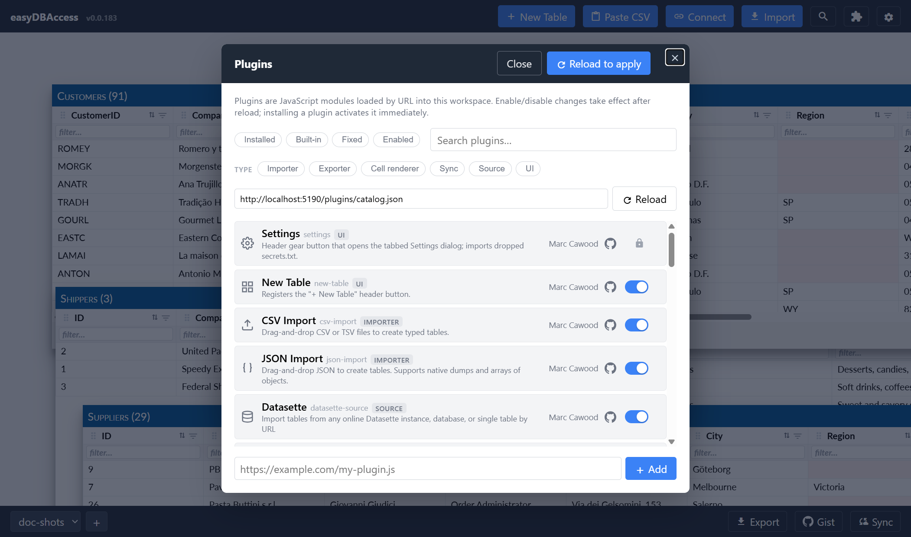

# Settings & Plugins

## Settings

Open Settings from the gear icon in the header. It's a tabbed dialog: a
**General** tab (your workspace's display title, and a place to manage
secrets), plus one tab for each feature that has its own configuration
(Gist sync, server sync, and so on). Changes save immediately as you type —
there's no separate Save button.


See [Settings](settings.md) for the full guide: field types, workspace vs.
device scope, and how secrets work.

## Plugins

Almost everything in easyDBAccess — CSV import, sync buttons, cell
renderers — is a **plugin**: a small, sandboxed piece of code that adds one
feature. This means the app is easy to extend, and easy to trim down if you
don't need a feature.

Open the **Plugin Manager** (the small icon next to Settings) to:

- **Enable or disable** any built-in feature you don't want.
- **Add a plugin by URL** — paste a link to a plugin's `.js` file and it's
  fetched, cached for offline use, and loaded on next startup.
- **Filter** the list by type (importer, exporter, cell renderer, sync,
  etc.) or by installed/enabled state.



Plugin URLs travel with your workspace, so a plugin you add shows up on
your other synced devices too.

Writing your own plugin is a single JavaScript file:

```js
export const meta = { name: 'my-plugin', version: '0.0.1' };

export function load(api) {
  api.ui.registerHeaderButton({
    id: 'my-plugin:hello',
    label: 'Hello',
    onClick: () => api.ui.dialogs.alert('hi from a plugin'),
  });
}
```

See the [developer plugin docs](../tech/PLUGINS.md) for the full API.
