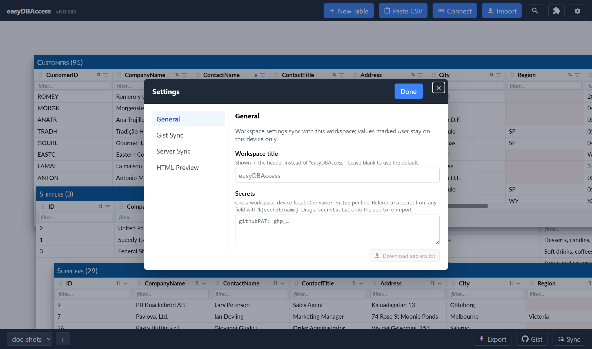

# Settings

## Opening Settings

Click the gear icon in the header. This opens a tabbed dialog.



There's no Save button. Each field saves as soon as you change it.

## General tab vs. plugin tabs

- **General** — the workspace title, and the secrets store (see below).
  The title is what the workspace is called on screen: the header, the browser
  tab, and the workspace list at the top left. Clear it and all three go back to
  the workspace's own name.
- One tab per feature that has settings — for example **Gist Sync**,
  **Server Sync**, or **Datasette**. A feature only gets a tab if it
  registered one; not every feature has settings to show.

### The Table grid tab

Preferences for how every grid behaves:

- **Sort descending first** — a first click on a column header sorts from the
  high end down. Turn it off to start ascending.
- **Highlight empty cells** — an empty cell gets a pink background, so a gap is
  visible whatever the column draws. Turn it off for a table that is empty on
  purpose, where the colour is only noise. A value that does not fit its column
  type stays marked red either way, because that is a fault and not a gap.
- **Highlight cells Validate flagged** — after the ✓ button checks a table, every
  cell that broke a rule gets the same pink background, and the reason is in its
  tooltip. Turn the colour off to read the reasons on hover alone. The marks go
  away by themselves when a later run finds nothing.
- **Read big tables one page at a time (rows)** — a table with at least this many
  rows is read one page at a time as you scroll, instead of being held in memory
  whole. It opens in a moment rather than in a second and a half. Sorting,
  filtering and searching still cover every row, because the store does that work.
  Set it to 0 to always read the whole table. This works in the browser and in the
  desktop app. The row count in the window title can lag the rows by a few seconds
  on a very big table — counting it takes longer than showing it, so the rows come
  first.

They apply at once to the tables you already have open.

## Editing a field

Click into a field and change it. The field saves on change — no separate
step needed. Fields can be text, a number, a checkbox, a date, a set of
radio buttons, or a set of checkboxes, depending on what the setting is for.

## Workspace vs. this device only

Every field has a small **user** checkbox next to its label.

- **Unchecked (default):** the value is stored with your workspace. It
  syncs to your other devices along with your tables.
- **Checked:** the value stays on this device only. It never syncs, and
  never leaves with an export.

Use "this device only" for anything that shouldn't follow your data around —
a personal access token, a machine-specific URL, or a setting you want
different on each device.

## Example: the Datasette tab

If you use the Datasette import or connect features, they share one
**Datasette** tab with:

- **Max import rows per table** — caps how many rows a single import
  brings in. 0 means unlimited.
- **Page size** — how many rows are requested per page while paging a table.
- **Connected table row cap** — the row limit for a live-connected table.
- **Rate-limit retry wait (seconds)** — how long to wait before retrying
  after the Datasette instance rate-limits a request.

This tab is one example of a settings tab that isn't tied to a single
feature — it's shared by both the import and connect features, since they
need the same options.

## Secrets

A **secret** is a value — usually an access token or password — that you
never want copied into your synced workspace or an exported file.

### Why secrets never sync

Secrets live in their own store, separate from every other setting. This
store is device-local: it doesn't sync with your workspace, and it's not
included when you export a `.db.json` file.

### The secrets store

On the **General** tab, the Secrets box holds one secret per line:

```
name: value
```

For example:

```
githubPAT: ghp_abc123…
```

Blank lines and lines starting with `#` are ignored.

### Using a secret in a setting

In any setting field, write `${secret:name}` instead of the raw value. When
the app reads that setting, it swaps in the matching secret. A **secret**-
type field also gets a small dropdown next to it listing your stored secret
names, so you can insert the reference without typing it.

If a secret-type field holds a raw value instead of a `${secret:name}`
reference, the field gets a red border and the dialog won't let you close
it — click into it and either clear it or replace it with a reference, so
the raw value is never saved.

If a field references a secret name that doesn't exist in your store, the
dialog blocks closing there too, and tells you which name is missing.

### Exporting your secrets

Click **Download secrets.txt** (below the Secrets box) to save your current
secrets as a file. You can also just select the text in the box and copy
it. Keep this file somewhere safe — it's the only copy outside the app.

### Importing secrets on another device

Drag a `secrets.txt` file onto the app window. If you already have secrets
stored, you're asked to confirm before they're replaced — dropping the file
does not silently overwrite anything. Confirm, and every `name: value` line
in the file becomes a secret on this device.
