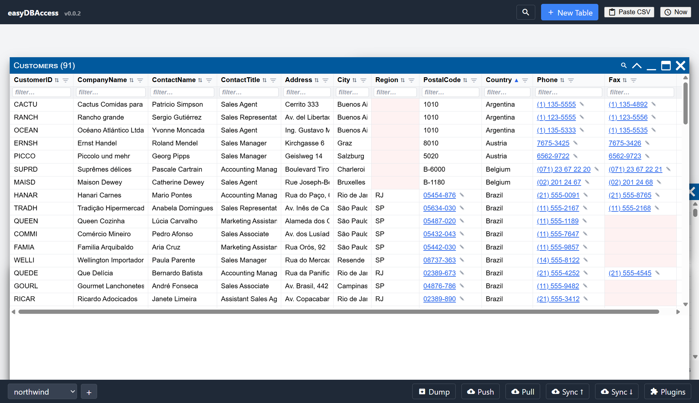
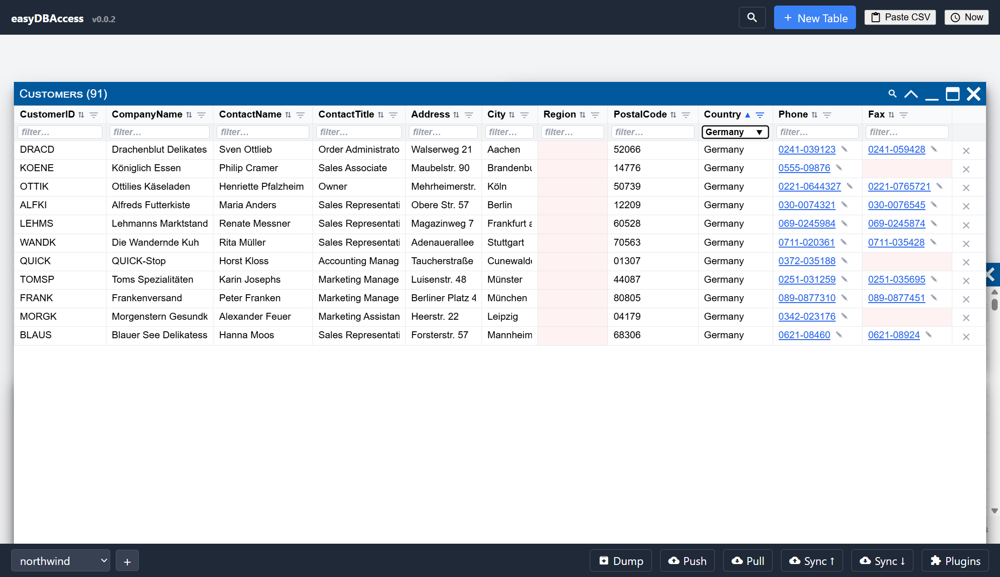

# Sorting, Filtering & Search

## Sorting

Click a column header to sort by it. Click again to reverse the direction,
and a third click removes the sort. Numbers sort as numbers (so `10` comes
after `2`, not before), and dates sort chronologically.

## Filtering a column

Click the funnel icon on a column header to open its filter. You get a
dropdown of the values that actually appear in that column (up to 500
unique values), so you can pick instead of typing.

Each value in the dropdown has three states, cycled by clicking it:

- **Off** (empty checkbox) — no effect.
- **On, green** — only show rows with this value.
- **On, red (negated)** — hide rows with this value.

You can turn on several values at once, mixing includes and excludes.

Each click applies at once, so there is nothing to confirm. Close the list with
**Esc**, the × in its corner, or a click outside it — the filter you built stays
on either way, and the window behind the list is not affected.

### Typing a filter directly

You can also just type into the filter box:

| Type this | To get                              |
| --------- | ----------------------------------- |
| `text`    | Rows containing `text`              |
| `!text`   | Rows that do **not** contain `text` |
| `^text`   | Rows that **start with** `text`     |
| `=text`   | Rows that are **exactly** `text`    |
| `NULL`    | Rows where the value is blank/empty |
| `!NULL`   | Rows that have any value at all     |

`^` and `!` can be combined, and you can list several values separated by
commas.

A comma means OR. To ask for two things at once, put `AND` between them:

| Type this         | To get                               |
| ----------------- | ------------------------------------ |
| `Sweden,Norway`   | Sweden **or** Norway                 |
| `!NULL AND Biden` | Has a value **and** contains "Biden" |
| `^B AND !Bush`    | Starts with "B" but is not a Bush    |
| `a AND b,c`       | (a **and** b) **or** c               |
| `a OR b`          | The same as `a,b`                    |

`AND` and `OR` count as operators only in capitals and only on their own, so
"brand" and "Andrew" stay ordinary words. To search for the word itself, put
the value in quotes: `"Salt AND Pepper"`.

### Filters narrow each other (faceting)

Picking a value in one column's filter narrows what shows up in every other
column's dropdown. For example, filtering **Country = Sweden** narrows the
**City** dropdown down to Swedish cities — but the **Country** dropdown
itself keeps listing every country, so you can always widen your filter
again.

A column with long, free-text values (a description field, say) won't offer
a dropdown at all — only a plain typed filter — since a value list wouldn't
be useful there.

### A filter on a hidden column

A hidden column has no header, and so no funnel to open. Its filter keeps
working, which can look like rows that have gone missing for no reason.

Open the column editor to see it: a blue funnel is shown on every column that
has a filter, whether the column is hidden or not. Click the funnel to switch
that filter off, and click it again to bring it back. The change applies when
you press Save.

## Columns you cannot search

A column whose value comes from a script holds nothing of its own — the value is
worked out from the row each time it is shown. Searching it would look at empty
cells and find nothing, so it offers no funnel and the search skips it. Give the
column real data and it becomes searchable again by itself.

## Search

Each table has its own local search box (an icon that expands into a text
field), and the header has a global search box that searches every open
table at once. Filters, local search, and global search all apply together
— a row has to pass all three to show up.

Typing multiple words searches for the whole phrase first, then falls back
to every word (AND), then to any word (OR). You can also spell out the logic
yourself with uppercase `AND`/`OR`, e.g. `berlin AND active`.
