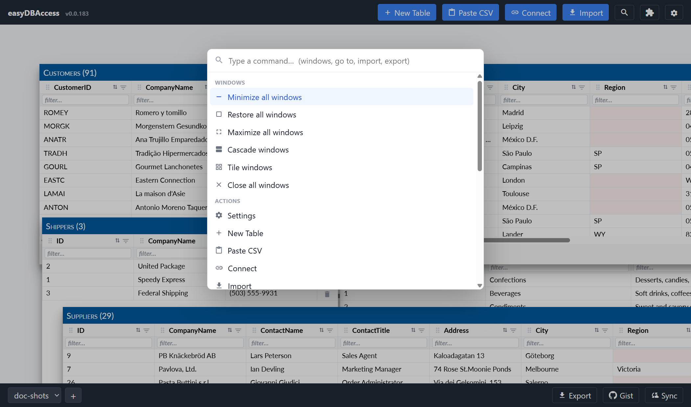

# Tables and Windows

Each table (and each [view](views.md)) opens in its own floating window,
like a document on a desktop. You can drag, resize, minimize, and maximize
these windows freely.

## Moving and resizing

- **Drag** a window by its title bar to move it anywhere.
- **Resize** by dragging any edge or corner.
- **Minimize** collapses a window to save space — its data stops loading
  in the background until you expand it again, so a minimized table doesn't
  slow down the rest of your workspace.
- **Maximize** fills the screen; double-clicking the title bar also toggles
  maximize/restore.
- Positions, sizes, and minimized/maximized state are all remembered — close
  the tab and reopen it, and your windows come back exactly as you left
  them, including which one was on top.

## Panning and zooming your workspace

If you have many windows, or one has drifted off-screen, the whole canvas
can be panned and zoomed:

- **On a touchscreen:** one finger drags the empty background to pan; two
  fingers pinch to zoom; double-tap resets to normal.
- **On a desktop:** hold the right mouse button and drag anywhere on the
  empty background to pan.

## Closing vs. deleting a table

Closing a table's window only **hides** it — your data is untouched, and you
can bring it back any time from the [Command Palette](#command-palette)
(search for "Go to `<table name>`").

To delete, use the trash icon in that table's own toolbar. It asks what should
go, and every option says how many rows that is:

- **Delete All Data** — every row. The table, its columns and its settings stay,
  so you can import into it again.
- **Delete Visible Data** — only the rows a filter or a search has left on
  screen. Offered when something narrows the table, and it takes every matching
  row, not only the page you can see.
- **Delete Table** — the table itself, rows included.

None of the three can be undone, so the list is the confirmation: read the row
count on the option before you click it. Cancel is in the dialog header.

A live table (one connected to a server) has no local rows, so the trash icon
there only removes the connection. Your data stays on the server.

## The Command Palette

Press **Ctrl+K** (or **Cmd+K** on a Mac) anywhere in the app to open the
Command Palette — a searchable list of everything you can do:

- Jump straight to any table or view.
- Run any header/footer button (Import, Export, Sync, Settings, …) without
  hunting for it.
- Run window commands: minimize/restore/maximize all, cascade, tile, or
  close everything at once.

Type to filter, use the arrow keys to move, **Enter** to run, and **Esc** to
close.

## The preview in the column editor

The column editor shows the first 100 rows below the columns. Each cell is
checked against the settings you have typed, and a cell that breaks one is
marked red.

Only 100 rows are read, so the editor opens as quickly for a table of a million
rows as for a small one. The preview fills a moment after the editor appears. If
the rows cannot be read, the preview tells you — your column changes still save.

## Getting a deleted column back

Deleting a column in the column editor removes its values, and the app remembers
the name so a refresh cannot bring the column back on its own. That list is shown
at the bottom of the editor as **Removed earlier** — click a name and the column
is added again. It comes back empty, because the values went with it; a table that
refreshes from a source fills it again on the next refresh. Nothing changes until
you press Save.

## Renaming a table

A table's title bar can show a friendlier name than its technical one — set
it from the column editor (the icon in the table's toolbar). Exports and
sync still use the technical name underneath.
