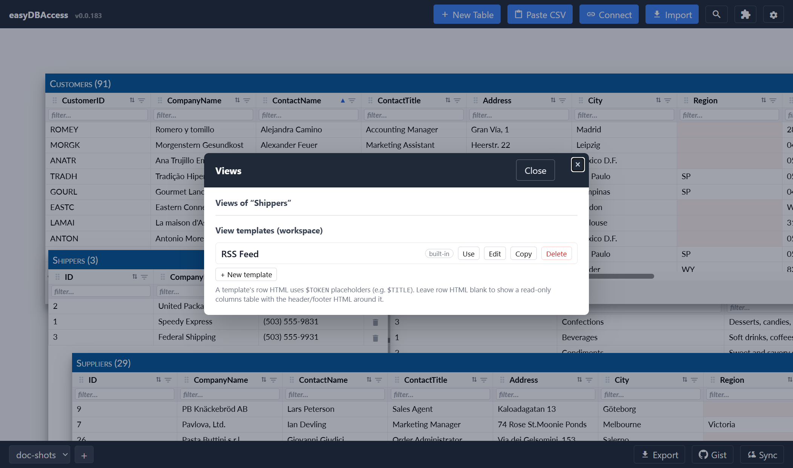

# Views

A **View** is a read-only, styled way to look at a table's data — useful for
things like an RSS-style feed, a card layout, or any custom HTML rendering
of your rows, without touching the underlying table.

## Templates and instances

- A **template** is a reusable layout: HTML for the header, one row, and the
  footer, with `$TOKEN` placeholders that get replaced with column values.
  easyDBAccess ships a default "RSS Feed" template to start from.
- An **instance** applies a template to a specific table. You can have
  several instances of the same template pointed at different tables, each
  with its own column mapping, sort, filters, and row limit.

Open the **Views** icon in a table's own toolbar to create, edit, or open a
view for that table.

## Placeholders

A `$TOKEN` in the template shows the mapped column **the way the table shows
it** — a column with the Link renderer comes out as a link, one with Tags as
pills. The mapping list has a 🎨 / 🔤 button per placeholder to switch between
that and the plain stored value; `$raw.TOKEN` says the same thing in the
template itself. A placeholder inside a tag, as in ``, always
gives you the plain value — an element inside an attribute would only break the
tag.

Two other prefixes: `$input.TOKEN` gives an editable control bound to the cell,
and `$filter.TOKEN` a chip that filters the view by that value when clicked.
Both always read the stored value, never the renderer.

## Handy defaults

When you create a view, easyDBAccess tries to auto-map your columns to the
template's tokens — URL-like fields become links, date-like fields become
dates, and long text fields become descriptions. You can also cap a view to
show only the top N rows.

## View windows

A view opens in its own window, just like a table (see
[Tables and Windows](tables-and-windows.md)) — you can drag, resize,
minimize, and maximize it the same way. View windows use a different color
so you can tell them apart from regular table windows at a glance.

A view can also be marked **read-only**, which shows dates and checkboxes as
plain text instead of editable controls — useful when the view is meant
purely for display.

If you delete and recreate a table under the same name, any view that was
pointed at it reconnects automatically.
